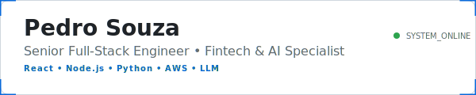
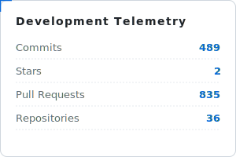
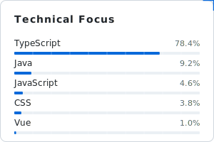

  

  
  

---

### 🚀 Professional Summary

I build scalable, production-ready systems end-to-end — from frontend architecture to backend services and cloud infrastructure.

With **7+ years** of experience in fintech, healthcare, and AI, I focus on performance, reliability, and developer experience.

---

### 🛠 Technical Expertise

**Frontend**  
`React` • `Next.js` • `TypeScript` • `Tailwind` • `Shadcn`

**Backend**  
`Node.js` • `Express` • `Django` • `REST APIs`

**Infrastructure**  
`AWS` • `Docker` • `CI/CD` • `CloudFront` • `S3` • `DynamoDB` • `Lightsail`

**AI & Search**  
`OpenAI` • `Gemini` • `Claude` • `LLaMA` • `Algolia`

---

### 📬 Contact

LinkedIn: [pedro-henrique-souza](https://www.linkedin.com/in/pedro-henrique-souza)  
Email: [pedro.alcarin@gmail.com](mailto:pedro.alcarin@gmail.com)
